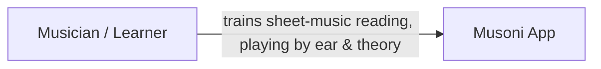
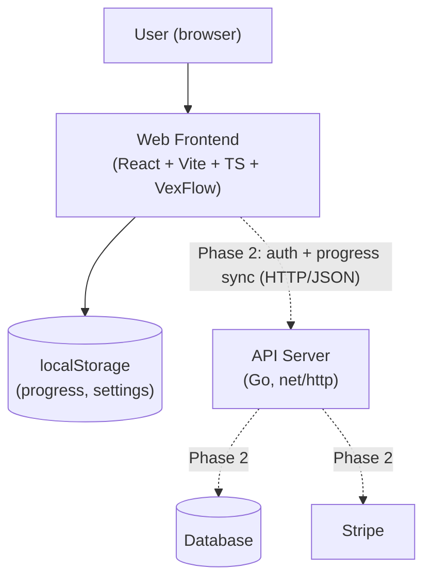
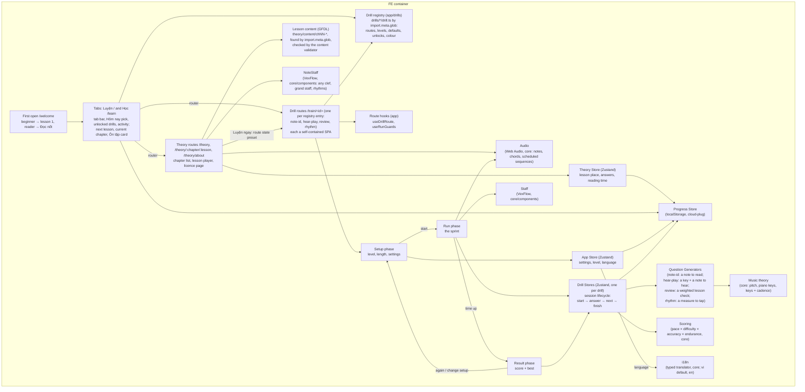
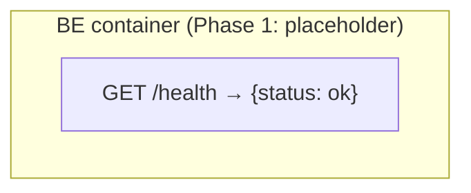

# Musoni — System Summary

> The whole system from user level down to component level — general, not detailed.
> Diagrams are Mermaid (text) so they can be updated with every change (doc-sync rule):
> any change that adds, removes, or rewires a container or component MUST update the
> matching diagram here in the same session.

## What is Musoni

A web app for pure sheet-music reading training combined with music theory.
Train reading speed and playing by ear with short drills, track improvement
day by day: note reading (see a note, name it) and Nghe & Đàn (hear a note in a
key, play it on the keys). Short bilingual theory lessons (adapted from an
open textbook under the GNU FDL) teach what the drills train, and each ends on
the drill that practises it; Ôn tập brings finished lessons' questions back.
Two tabs: Luyện (today's pick and the drills a reader has opened) and Học (the
next lesson and the current chapter).

**Design principle: mobile-first technique, hybrid target** - training must be
super comfortable on a phone, and desktop is a first-class layout rather than a
narrow phone column on a wide screen. Base styles are the phone; `md:` adds the
desktop layout, never the reverse (details: `fe/screens.md`).

## Phase plan

| Phase | Scope | Monetization |
|---|---|---|
| **1 (now)** | Note Identification drill, web only, no login, localStorage progress, activity calendar; Vietnamese-first UI (English second) | Free |
| **2 (started)** | Nghe & Đàn ear drill (built, `fe/drill-hear-play.md`), theory lessons (framework and chapter 1 built, `theory/framework.md`; chapters 2-9 being ported), "read the shape" drill, Tiết tấu rhythm drill (built, `fe/drill-rhythm.md`; replaces Complete-the-Measure), login, cloud progress sync, subscriptions (Stripe) | Freemium: basics free, premium = advanced levels + full stats (which drill levels are premium is not decided) |
| **3** | More ear training (echo phrases, chords), more theory drills | Premium |

## Level 1 — Context: who uses it, what it does

## Level 2 — Containers: deployable pieces and their links

Solid lines = Phase 1 (live). Dotted lines = Phase 2 (planned).

## Level 3 — Components per container

### Web Frontend (`web/`) — details in `docs/fe/`

Routing is app-level only: the router owns the two tabs (`/`, `/learn`), the
first-open question (`/welcome`), one `/train/<id>` route per registered drill
and the three theory routes, while each drill's three
phases (setup, run, result) and a lesson's steps are store state inside a
single route, so training never changes the URL. A
lesson's practice link opens a drill with a preset in the route state, applied
to that one session. Every drill is one entry in the drill registry
(`drills/<id>/drill.ts`, found by glob): routes, the loading screen, prefetch,
presets, unlocks, settings and bests read it, so adding a drill touches no app
code. The
route side every drill shares (the tabs' route state, back inside the drill,
pausing when the reader leaves) lives in two app hooks, and the screens' shared
parts (pad, header, pause sheet, result summaries) in `core/components`.

As built, there is no separate "Drill Engine" component: each Drill Store
holds the session lifecycle (`start` → `answer` →
`tick`/`next` → `finish`) and calls the Question Generator, Scoring, and
Progress Store directly. The Run phase calls Staff (VexFlow rendering) and
Audio Feedback directly using state read from the Drill Store.
`core/engine/` exists in the repo only as an empty placeholder folder —
no code has been written against it. The second drill (Nghe & Đàn) kept its
own store too: the two share the session shape (clock, pause, partial
results) but differ in what a question is and when its clock starts, so the
shared parts went into hooks and components instead. The third, Ôn tập, also kept its own store
(its questions are lesson checks); the drills being built next are the point
to extract the clock and pause logic into `core/engine` if it repeats again.

### API Server (`server/`) — details in `docs/be/`

Grows real components (auth, progress sync, billing) in Phase 2.
