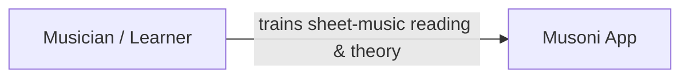
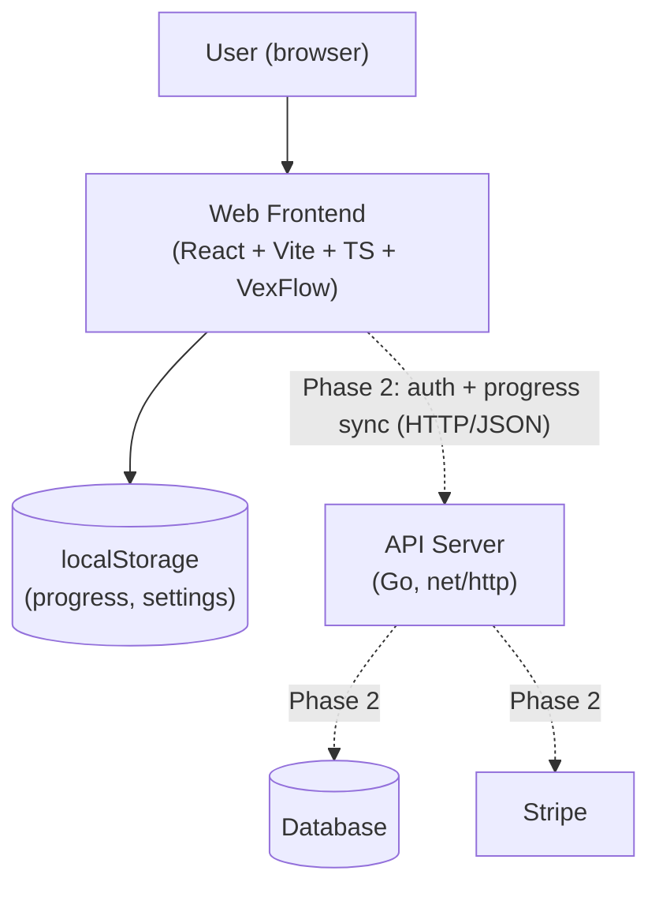
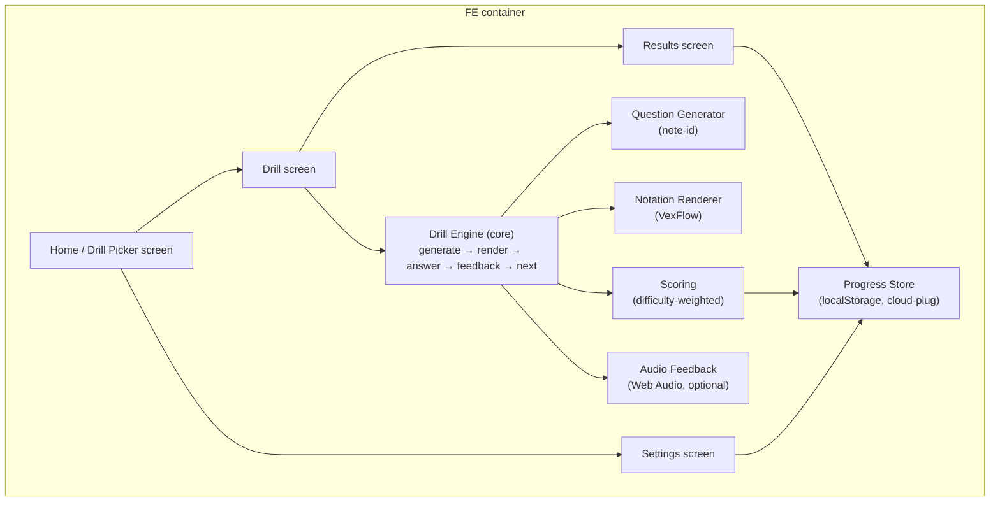
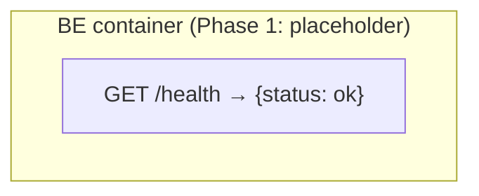

# Musoni — System Summary

> The whole system from user level down to component level — general, not detailed.
> Diagrams are Mermaid (text) so they can be updated with every change (doc-sync rule):
> any change that adds, removes, or rewires a container or component MUST update the
> matching diagram here in the same session.

## What is Musoni

A web app for pure sheet-music reading training combined with music theory.
Train reading speed with short drills, track improvement day by day.
Ear training joins in a future phase (see phase plan below).

## Phase plan

| Phase | Scope | Monetization |
|---|---|---|
| **1 (now)** | Note Identification drill, web only, no login, localStorage progress, day-by-day tracker | Free |
| **2** | Complete-the-Measure drill (design done: `fe/drill-complete-measure.md`), login, cloud progress sync, subscriptions (Stripe) | Freemium: basics free, premium = advanced levels + full stats |
| **3** | Ear training, more theory drills | Premium |

## Level 1 — Context: who uses it, what it does

## Level 2 — Containers: deployable pieces and their links

Solid lines = Phase 1 (live). Dotted lines = Phase 2 (planned).

## Level 3 — Components per container

### Web Frontend (`web/`) — details in `docs/fe/`

### API Server (`server/`) — details in `docs/be/`

Grows real components (auth, progress sync, billing) in Phase 2.
