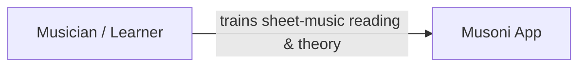
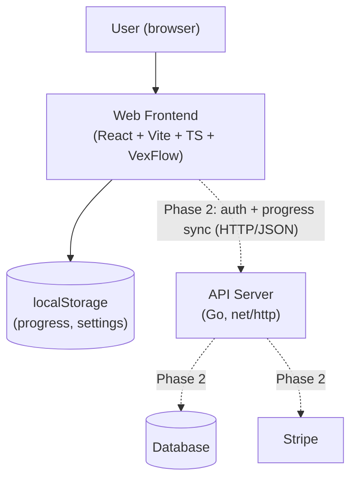
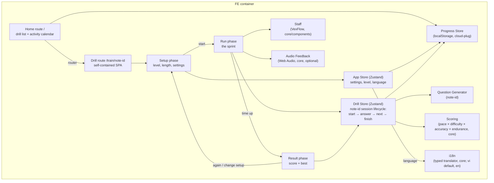
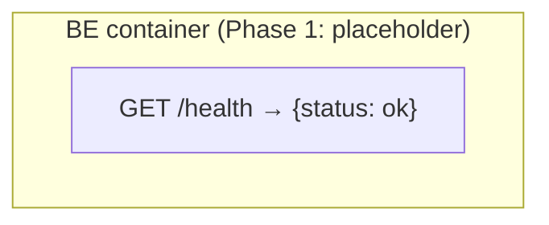

# Musoni — System Summary

> The whole system from user level down to component level — general, not detailed.
> Diagrams are Mermaid (text) so they can be updated with every change (doc-sync rule):
> any change that adds, removes, or rewires a container or component MUST update the
> matching diagram here in the same session.

## What is Musoni

A web app for pure sheet-music reading training combined with music theory.
Train reading speed with short drills, track improvement day by day.
Ear training joins in a future phase (see phase plan below).

**Design principle: mobile-first technique, hybrid target** - training must be
super comfortable on a phone, and desktop is a first-class layout rather than a
narrow phone column on a wide screen. Base styles are the phone; `md:` adds the
desktop layout, never the reverse (details: `fe/screens.md`).

## Phase plan

| Phase | Scope | Monetization |
|---|---|---|
| **1 (now)** | Note Identification drill, web only, no login, localStorage progress, activity calendar; Vietnamese-first UI (English second) | Free |
| **2** | Complete-the-Measure drill (design done: `fe/drill-complete-measure.md`), login, cloud progress sync, subscriptions (Stripe) | Freemium: basics free, premium = advanced levels + full stats |
| **3** | Ear training, more theory drills | Premium |

## Level 1 — Context: who uses it, what it does

## Level 2 — Containers: deployable pieces and their links

Solid lines = Phase 1 (live). Dotted lines = Phase 2 (planned).

## Level 3 — Components per container

### Web Frontend (`web/`) — details in `docs/fe/`

Routing is app-level only: the router owns `/` and `/train/note-id`, while the
three drill phases (setup, run, result) are store state inside that single
route, so training never changes the URL.

As built, there is no separate "Drill Engine" component: the note-id
Drill Store itself holds the session lifecycle (`start` → `answer` →
`tick`/`next` → `finish`) and calls the Question Generator, Scoring, and
Progress Store directly. The Run phase calls Staff (VexFlow rendering) and
Audio Feedback directly using state read from the Drill Store.
`core/engine/` exists in the repo only as an empty placeholder folder —
no code has been written against it. If a second drill (Phase 2:
Complete-the-Measure) needs to share lifecycle code, extracting a real
`core/engine` at that point is the natural refactor; for one drill,
inlining it in the store was the honest simpler choice.

### API Server (`server/`) — details in `docs/be/`

Grows real components (auth, progress sync, billing) in Phase 2.
